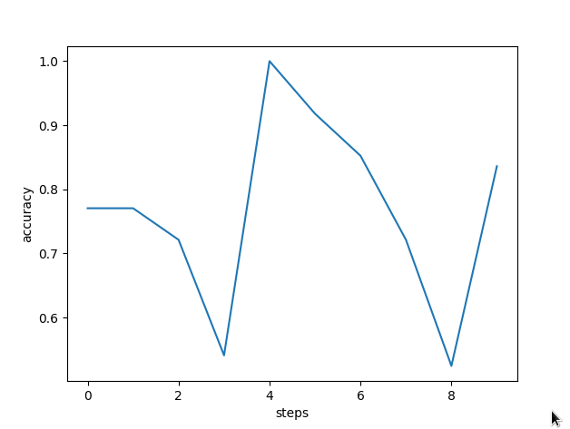
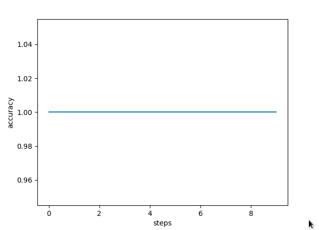
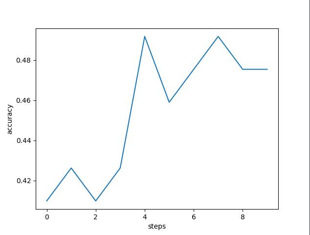
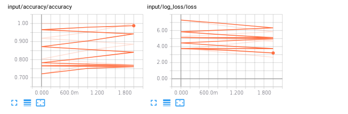

# Crytosystem Identifier  

## Introduction  
Cryptography is associated with the process of converting plain text into unintelligible
text and vice versa. The goal of problem is to identify the cryptosystem used in
encrypting a given cryptogram using Support Vector Machine (SVM) and Back
propagation Neural Networks (BPNN). We consider that the cryptogram are derived
using Simple substitution or Vigenere.  

### Substitution Cipher:  
Simple substitution (SS) ciphers work by replacing each plaintext character by
another one character. To decode cipher text letters, one should use reverse
substitution and change the letters back.  

### Vigenere Cipher:  
Vigenere cipher is a kind of polyalphabetic substitution cipher. It is about replacing
plaintext letters by other letters. Parties have to agree on a common shared keyword
(which may also be a sentence), which is used during encryption algorithm.

## Setup  

### Data generation
The plain text for training is in `train_plain.txt` and for test is in ```test_plain.txt```
To generate the dataset, run:
``` python generator.py```
The testing and training cipher text is saved as ```train_cipher.txt``` and ```test_cipher.txt```.

The training set consists of 304 samples with 152 samples each of substitution and vignere cipher.
The test set consists of 20 samples with 10 samples each of substitution and vignere cipher.

### Training  
* Support vector machine and Back propagation neural networks are used to identify the cryptograms.
The `frequency` of the characters from A to Z has been used as features for training the models. So 26 features
i.e frequency of characters in cipher text is fed as input to the models and the output is a one hot encoded vector
for substituion and vigenere cipher.  
* The SVM model has been tested with different kernels and with different values of gamma and C. The BPNN has been tested
with different weight initializations incluted normal, xavier and glorot. The BPNN is a fully connected network with 26 nodes 
in the input layer with each node denoting the frequency of a character, hideen layer size is 50 and sigmoid activation function
is used as the activation function at the output layer.  
* The logarithmic loss has been used in both the models
* KFold validation for validating our dataset with k = 5
* The accuracy metrics has been used as the performance metrics.

### Results
#### SVM 
##### rbf kernel 
##### polynomial kernel 
##### sigmoid kernel 
##### Back propagation neural network 
